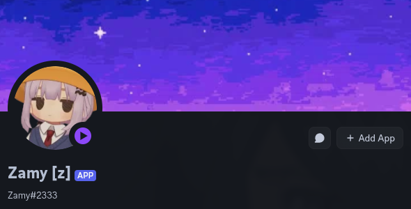
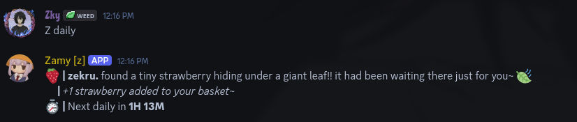

<div align="center">



# 🍓 Zamy~reminder
**The OwO utility bot your server actually needs**

*Smart reminders • Intelligent quest board • HuntBot alerts • Berry economy*



[Invite Zamy](https://discord.com/oauth2/authorize?client_id=1478470003052384436&permissions=519232&integration_type=0&scope=bot) • [Support Server](YOUR_SERVER_LINK_HERE)

</div>

---

## What is Zamy?

Zamy is a lightweight OwO utility bot that fills in everything OwO doesn't cover for you.

No more tabbing back to check if your cooldown is up. No more spamming "anyone help my quest??" in chat. No more missing your HuntBot. Zamy quietly watches and handles it all. 🍓

---

## 🍓 Why Zamy?

Zamy only starts the cooldown timer when it detects you genuinely hunted, prayed, or owo'd — so reminders are always accurate, never spammy, and never wasted. If you didn't run the command, you don't get pinged. Simple.

- 🎞️ **Tenor GIF support** — paste a Tenor link into any custom message and Zamy sends the GIF alongside your reminder
- 🔔 **Custom reminders** — unlock a personal reminder slot for any OwO command, with your own trigger, cooldown, and message

---

## ⚡ Smart Cooldown Reminders

Zamy watches for your `hunt` `battle` `pray` `curse` and `owo` commands and pings you exactly when you're ready to go again.

Fully customizable per reminder type — toggle the ping, enable reply mode, set auto-delete, and write your own custom reminder message. Admins can also configure a server-wide reminder message for all members.

Works with any OwO prefix — `w` `o` `owo` `uwu` or custom.

---

## 🔔 Custom Reminders

Unlock a personal reminder slot from the berry shop and set it for **any OwO command Zamy doesn't already cover** — zoo, daily, pup, or anything else. You choose the trigger keyword, the cooldown duration, and the message.

Use `{USER}` anywhere in your message to ping yourself when the reminder fires~

---

## 🎞️ Tenor GIF Support

Custom reminder messages and HuntBot DM messages both support **Tenor GIF links**. Just paste a Tenor URL into your message and Zamy will send the GIF alongside your reminder — because a plain text ping is boring.

---

## 📜 Intelligent Quest Board

OwO quests are difficult to complete alone — Zamy fixes that.

Run `z addq` and then `owo quest` — Zamy reads your quest log automatically and posts your active quests to a dedicated board channel so the entire server can see who needs help and jump in.

What makes it actually intelligent — **it tracks progress live**. When someone prays, curses, gives a cookie, or uses an action command on you, the board updates itself in real time. No manual updates. No stale entries. No confusion about what's already done.

Quest complete? Zamy DMs you immediately. 🍓

The board also cleans itself — quests expire automatically after 12 hours of no activity.

---

## 🤖 HuntBot DM Alerts

React 🍓 on any HuntBot message and Zamy will DM you the moment your HuntBot is back and ready to hunt again. Remove your reaction at any time to cancel.

Unlock a custom HuntBot DM message from the berry shop for a personal touch.

---

## 🌸 Daily & Berry Economy

Claim `z daily` once a day for a 🍓 berry — each claim comes with a randomized story from 20 unique ones.

Earn berries and spend them in `z shop` to unlock a custom reminder slot for any OwO command Zamy doesn't already cover, or a custom HuntBot DM message. **Both support `{USER}` as a ping placeholder and Tenor GIF links** — so your reminders can be as personal and expressive as you want.

---

## 🛠️ Setup

Two commands and Zamy is ready to go.

```
z setchannel quest #channel   — set the quest board channel
z setchannel #channel          — restrict reminders to one channel (optional)
owoprefix <prefix>             — set your server's OwO prefix if it isn't owo
```

---

## 📋 Commands

**Reminders**
```
z hunt          — hunt reminder settings
z pray          — pray reminder settings
z owo           — owo reminder settings
```

**Quest Board**
```
z addq          — add your OwO quests to the board
z q             — view the quest board
```

**Economy**
```
z daily         — claim your daily 🍓
z berry @user   — give someone a berry
z shop          — browse the berry shop
z reminder      — view and manage your custom reminders
```

**Misc**
```
z help          — full command list
```

---

<div align="center">

For help, reach out to **@zky** 🍓

</div>
